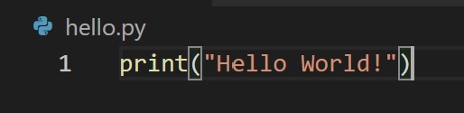

# Overview

This is a simple *Hello World* program. Here I show how you can use Visual Studio Code and Python to create a simple hello world program. This shows how you can use these programs together.

[Hello World Demo](https://youtu.be/OlZumvc9410)

# Development Environment

I used Visual Studio Code (VS Code) to run the hello world program. VS Code is an IDE which allows me to edit and run the code I write, in this case I am writing in Python.

I used Python which is a computer language that allows my to write a script which the computer will execute.

# Useful Websites

* [W3Schools](https://www.w3schools.com/python/ref_func_print.asp)